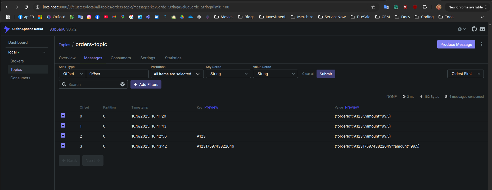
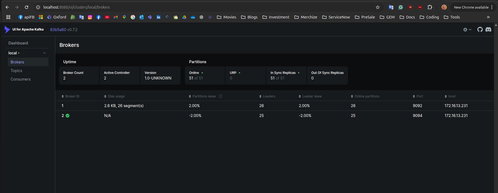

## Schema-first (chuẩn nhất, enterprise)

Viết .avsc (Avro) hoặc .proto (Protobuf).

Commit vào repo schemas/.

Dùng tool generate ra TypeScript types từ schema.

Dùng type đó trong code → compile-time safety.

Khi update schema, CI/CD validate compatibility với Schema Registry.

👉 Cách này được dùng nhiều trong fintech, e-commerce lớn (Shopify, Grab, Netflix).

## Code-first (ít formal, startup hay xài)

Định nghĩa TypeScript type/interface trong code.

Dùng codegen tool convert TS type → Avro schema → push vào Registry.

