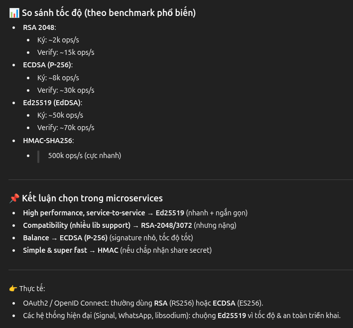

# 🔐 Thuật toán Mã hóa thông dụng
## Mã hóa đối xứng (Symmetric)
| Thuật toán            | Đặc điểm                                    | Ứng dụng                      |
| --------------------- | ------------------------------------------- | ----------------------------- |
| **AES (128/192/256)** | Chuẩn hiện đại, rất mạnh, nhanh.            | TLS, VPN, Disk encryption.    |
| **DES / 3DES**        | Cũ, yếu (DES); 3DES an toàn hơn nhưng chậm. | Legacy system.                |
| **ChaCha20**          | Nhanh, an toàn, thay thế AES trong mobile.  | TLS (Google/Cloudflare dùng). |

## Mã hóa bất đối xứng (Asymmetric)
| Thuật toán                                           | Loại       | Ưu điểm                                                        | Nhược điểm                                               | Tốc độ                           |
| ---------------------------------------------------- | ---------- | -------------------------------------------------------------- | -------------------------------------------------------- | -------------------------------- |
| **RSA (RSA-SHA256, RSA-PSS)**                        | Asymmetric | Rất phổ biến, hỗ trợ rộng rãi, dễ rotate key                   | Khóa dài (2048+ bit), signature to (\~256B), verify chậm | Ký: chậm ⏳, Verify: trung bình  |
| **ECDSA (Elliptic Curve DSA, secp256r1, secp256k1)** | Asymmetric | Signature nhỏ (\~64B), bảo mật cao với key ngắn, nhanh hơn RSA | Ít lib chuẩn hơn RSA, ký hơi chậm hơn verify             | Ký: trung bình, Verify: nhanh ⚡ |
| **EdDSA (Ed25519, Ed448)**                           | Asymmetric | Rất nhanh, signature ngắn, chống lỗi triển khai, hiện đại      | Chưa được mọi lib hỗ trợ như RSA                         | Ký: nhanh ⚡, Verify: nhanh ⚡   |
| **HMAC (SHA-256, SHA-512)**                          | Symmetric  | Nhanh nhất, đơn giản, chỉ cần 1 secret                         | Phải share secret giữa client & server                   | Ký/Verify: cực nhanh 🚀          |




# Hashing and HMAC
- HMAC (Hash-based Message Authentication Code) = cơ chế dùng hàm băm + secret key để tạo ra mã xác thực.
- `HMAC = hash(secret + message)`

| Thuật toán                   | Đặc điểm                                   | Ứng dụng                               |
| ---------------------------- | ------------------------------------------ | -------------------------------------- |
| **MD5**                      | 128-bit, nhanh, nhưng đã yếu, dễ collision | Checksum file (không dùng cho bảo mật) |
| **SHA-1**                    | 160-bit, mạnh hơn MD5 nhưng đã bị phá      | Git commit hash, TLS cũ                |
| **SHA-2** (SHA-256, SHA-512) | An toàn, chậm hơn MD5/SHA-1                | TLS, JWT, HMAC                         |
| **SHA-3 (Keccak)**           | Chuẩn mới, rất an toàn                     | Ứng dụng trong blockchain              |
| **BLAKE2**                   | Nhanh hơn SHA-2, bảo mật tốt               | Hash password, blockchain              |
| **bcrypt / scrypt / Argon2** | Hash + salt + chậm                         | Bảo mật password                       |


# Hybrid use case
```less
Service A (Client)                        Service B (Server)
──────────────────────────────────────────────────────────────

1. Generate AES key (K_aes)
   ──────────────►   (none)
   Input: random seed
   Output: AES key (K_aes)

2. Encrypt K_aes bằng Public Key (PK_B)
   ──────────────►   RSA/ECC: Enc(PK_B, K_aes)
   Input: K_aes, PK_B
   Output: K_aes_encrypted

3. Send K_aes_encrypted to B
   ──────────────►   Receive (K_aes_encrypted)

4. Decrypt K_aes bằng Private Key (SK_B)
   ◄─────────────   RSA/ECC: Dec(SK_B, K_aes_encrypted)
   Input: K_aes_encrypted, SK_B
   Output: K_aes

5. Cả A & B đều có K_aes
   ──────────────►   Dùng AES để mã hóa/giải mã message
   Input: message, K_aes
   Output: ciphertext (AES)

```