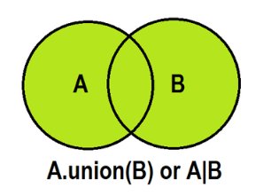

# REFs
- https://www.hackerrank.com/domains/python?filters%5Bdifficulty%5D%5B%5D=easy&filters%5Bdifficulty%5D%5B%5D=medium&filters%5Bskills%5D%5B%5D=Problem%20Solving%20%28Basic%29&filters%5Bskills%5D%5B%5D=Python%20%28Basic%29&filters%5Bsubdomains%5D%5B%5D=py-basic-data-types&filters%5Bsubdomains%5D%5B%5D=py-introduction&filters%5Bsubdomains%5D%5B%5D=py-strings&filters%5Bsubdomains%5D%5B%5D=py-date-time&filters%5Bsubdomains%5D%5B%5D=py-debugging&filters%5Bsubdomains%5D%5B%5D=py-functionals&filters%5Bsubdomains%5D%5B%5D=py-sets&filters%5Bsubdomains%5D%5B%5D=errors-exceptions&filters%5Bsubdomains%5D%5B%5D=py-regex&filters%5Bstatus%5D%5B%5D=unsolved
# Python Collections (Arrays)
There are four collection data types in the Python programming language:

- List is a collection which is ordered and changeable. Allows duplicate members.
- Tuple is a collection which is ordered and unchangeable. Allows duplicate members.
- Set is a collection which is unordered, unchangeable*, and unindexed. No duplicate members.
- Dictionary is a collection which is ordered** and changeable. No duplicate members.

## Sets

