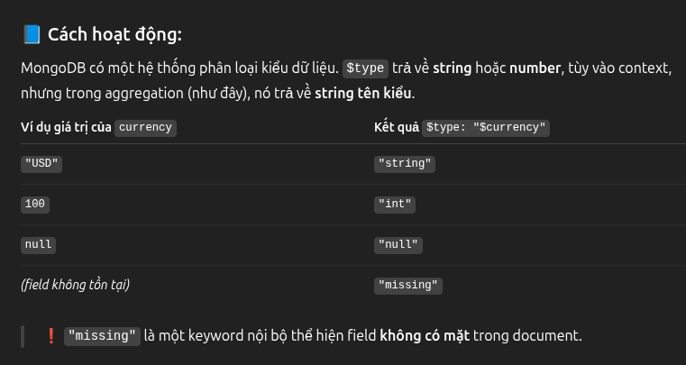

# Operator:
## $ne (aggregate)
`{"currency": { $ne: [{ $type: "$currency" }, "missing"] }}`

Image: 

- Lấy type của field r` so sánh vs value thứ 2, return kết quả so sánh 
- Hay dùng trong $project hay $filter 

## $filter (aggregate)
```js
[$filter: {
    input: {
        $objectToArray: {
            "currency": { $ne: [{ $type: "$currency" }, "missing"] }
        }
    },
    as: "item",
    cond: { $eq: ["$$item.v", false] }
}]
```

- Input là
```js
[
  { k: "currency", v: true }  // nếu tồn tại
  // hoặc
  { k: "currency", v: false } // nếu thiếu
]
``` 
rồi filter cho $$item.v == false đi qua
